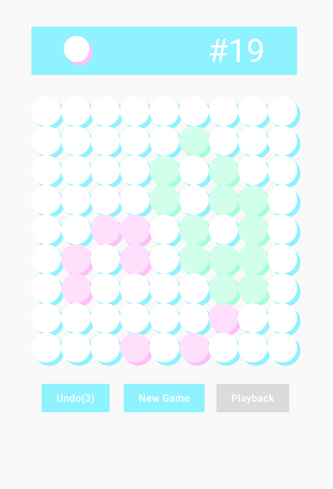

# Game of Life Go

Game of Life Go is a two-player version of the original [Conway's Game of Life](https://en.wikipedia.org/wiki/Conway%27s_Game_of_Life).

This game is played by two players placing pieces on the board in turns. After the first serveral rounds in which the players place the initial "seeds" (called "seeding rounds"), each time a player put a piece, Conway's Game of Life rules are to the board:

- if an occupied cell has less than 2 or more than 3 neighbors, it will become empty;
- if an occupied cell has exactly 2 or 3 neighbors, it will continue to be occupied with the same color;
- if an empty cell has exactly 3 neighbors, it will become occupied. Its color will be the color of the majority of its neighbors

Neighbors are defined as the number of adjacent cells. In the non-wrapping mode, each cell except for those at board boundaries has 8 neighbors; in the wrapping mode, the board boundaries are wrapped around so every cell has 8 neighbors.

The game ends when the board is occupied by only one color. The player with that color is the winner. If both colors are eliminated in the same round, the game ends in a draw.